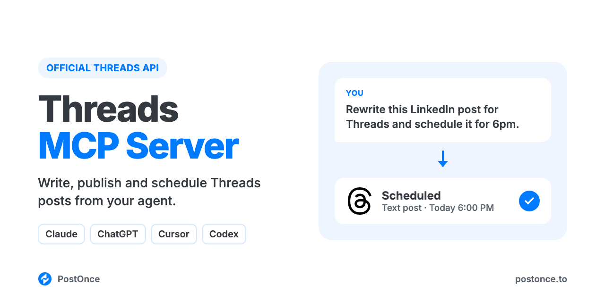

<p align="center"></p>

# Threads MCP Server

Threads MCP server for Claude, ChatGPT, Cursor and Codex. Your AI agent can write, publish and schedule Threads posts with text, images, video or carousels on your Threads profile through Threads' official API. There's no scraping, no browser automation and no Threads developer app to set up.

It runs on [PostOnce](https://postonce.to)'s hosted MCP server and comes with Threads skills, so your agent writes posts that sound like Threads, not a press release, before it posts one.

```
You:    Rewrite my LinkedIn post from this morning for Threads and schedule it
        for 6pm.
Claude: Rewrote it with the threads-crosspost-adapter skill: 280 characters,
        one opinion, a question at the end. Scheduled on PostOnce for 6:00 PM
        on @maya.builds.
```

Full setup guide with examples: [postonce.to/mcp/threads](https://postonce.to/mcp/threads)

## What you can do

| Ask your agent to | How it works |
| --- | --- |
| Publish a text post now (up to 500 characters) | `create_post` on your connected Threads account |
| Schedule a post for later | `create_post` with `publish_at` |
| Post an image or a video (up to 5 minutes) | `create_upload_url`, upload, then `create_post` with `media` |
| Post a carousel (up to 10 images and videos, mixed) | Upload each file, then pass them in order as `media` |
| Save a draft to finish later | `create_draft` |
| Check whether a post went out, and get its URL | `get_post` |
| Change or cancel a scheduled post | `update_post`, `cancel_post` |
| Post the same thing to Threads and other platforms | Add more targets to `create_post` (Instagram, X, LinkedIn, Bluesky, Facebook, TikTok, YouTube, Pinterest) |

Images are JPEG or PNG up to 8 MB; videos are MP4 or MOV up to 1 GB. Text over 500 characters is cut off, so keep each post within the limit.

Not supported: multi-post threads (reply chains), replies, polls, quote posts, topic tags, GIFs, analytics, reading or replying to comments, DMs, and editing or deleting posts that are already live. Each `create_post` publishes one standalone Threads post.

## Setup (about a minute)

You need a [PostOnce account](https://postonce.to) (free for 7 days, no card) with your Threads profile connected.

**Claude (claude.ai and desktop) and ChatGPT:** add a custom connector with the URL below and sign in with PostOnce. No API key.

```
https://postonce.to/mcp
```

Step-by-step: [Claude](https://postonce.to/integrations/claude) · [ChatGPT](https://postonce.to/integrations/chatgpt)

**Claude Code, Codex and Cursor:** install the plugin. It adds the MCP connection and the skills together. Claude Code asks you to sign in to PostOnce the first time you use it (or run `/mcp` and pick postonce), so there's no key to copy. In Codex and Cursor, create an API key in [PostOnce preferences](https://postonce.to/dashboard/preferences) and give it to your client as the `POSTONCE_API_KEY` environment variable. Never paste the key into chat.

```bash
# Claude Code
claude plugin marketplace add postoncehq/plugins
claude plugin install threads-mcp@postoncehq
```

Step-by-step: [Claude Code](https://postonce.to/integrations/claude-code) · [Codex](https://postonce.to/integrations/codex) · [Cursor](https://postonce.to/integrations/cursor)

**Any other MCP client:** point it at `https://postonce.to/mcp` (Streamable HTTP) with the header `Authorization: Bearer <your PostOnce API key>`.

## Skills included

| Skill | What it does |
| --- | --- |
| [`threads-post-writer`](skills/threads-post-writer/SKILL.md) | Writes Threads posts people reply to: conversational, one idea, under 500 characters, with an easy question to answer. |
| [`threads-crosspost-adapter`](skills/threads-crosspost-adapter/SKILL.md) | Rewrites an X, LinkedIn or Instagram post into a Threads-native post instead of pasting the same text everywhere. |
| [`threads-bio-generator`](skills/threads-bio-generator/SKILL.md) | Writes 150-character Threads bio options for you to paste into the app. |
| [`threads-content-calendar`](skills/threads-content-calendar/SKILL.md) | Plans 1 to 4 weeks of Threads posts from your goals or a source you want to repurpose, then schedules them. |
| [`postonce`](skills/postonce/SKILL.md) | Publishing workflow: pick the right account, upload media, schedule, and confirm the post actually went live. |

## FAQ

**Does Threads have an official MCP server?**
This server uses Threads' official API through PostOnce. You connect your profile once with Meta's own login, and your agent publishes through that connection.

**Can Claude post to Threads?**
Yes, once it's connected to an MCP server that can publish, like this one. Claude writes the post, then calls `create_post`.

**Is it safe for my Threads account?**
Yes. Posts go through Threads' official API with the permissions you grant when you connect. Many Threads MCP servers on GitHub drive a logged-in browser session or an unofficial, reverse-engineered API instead, which Meta's terms don't allow and which can get accounts restricted.

**Can it post a multi-post thread or reply to posts?**
No. Each post is published on its own; reply chains, replies and polls aren't supported. For a longer idea, the skills fit it into one 500-character post, or use a carousel of images to carry the detail.

**Do I need a Threads developer app or API approval?**
No. PostOnce holds the Threads API access; you just connect your profile.

**Is it free?**
The skills and this repo are free and MIT-licensed. Publishing runs through a PostOnce account, which you can try free for 7 days without entering a card. After that, see [pricing](https://postonce.to/pricing).

## Other platforms

The same connection posts everywhere PostOnce supports. Platform repos with their own skills:
[LinkedIn MCP](https://github.com/postoncehq/linkedin-mcp) · [Instagram MCP](https://github.com/postoncehq/instagram-mcp) · [TikTok MCP](https://github.com/postoncehq/tiktok-mcp) · [YouTube MCP](https://github.com/postoncehq/youtube-mcp) · [Facebook MCP](https://github.com/postoncehq/facebook-mcp) · [X (Twitter) MCP](https://github.com/postoncehq/x-mcp) · [Bluesky MCP](https://github.com/postoncehq/bluesky-mcp) · [Pinterest MCP](https://github.com/postoncehq/pinterest-mcp)

## License

MIT. See [LICENSE](LICENSE).
